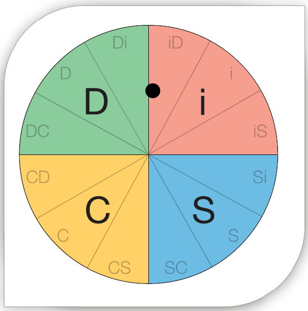
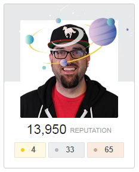
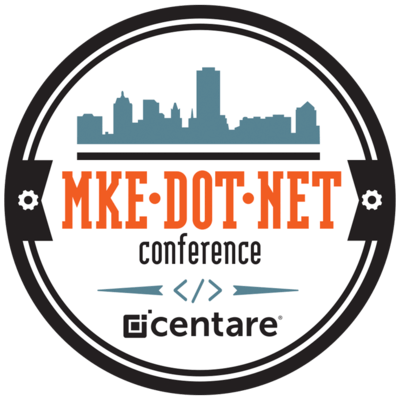

## Upgrade Yourself

 
[@davidpine7](https://twitter.com/davidpine7) | [davidpine.net](http://davidpine.net/)

---
# Intro
## TL;DR;

---

## Birth &nbsp; @fa[bug]
## Siblings &nbsp; @fa[child] x9
## Wealth &nbsp; @fa[money]--;
## Education &nbsp; @fa[frown-o]

---
> Expect nothing, but be grateful for everything

---?image=assets/holding-world.jpg&size=contain
## The World

Note:
We all want the world. We want to hold it in our hands, we want claim it as our own. We all have a sense of perpetuity whether in Code, Contributions or Projects. We want to feel like what we do matters.

---
> Let's make the world a better place

---?image=assets/college.jpeg&size=contain
## College

---?image=assets/cubicles.jpg&size=contain
## Opportunity

---?image=assets/calculator.jpeg&size=contain
## Early App

---?image=assets/1_week.png&size=contain
---?image=assets/1_month.png&size=contain
---?image=assets/1_year.png&size=contain
---?image=assets/3_years.png&size=contain
---?image=assets/6_years.png&size=contain
---?image=assets/10_years.png&size=contain

---
> I have not failed, I've just found 10,000 ways that won't work

---?image=assets/reflect.jpg&size=contain
## Know Thyself

Note:
I believe that you can never know anyone else without first knowing yourself. Think back to when you were a teenager, you thought you knew how people were. But you didn't, because you didn't first know who you were -- you were still figuring out who you were going to be.

---
> You must first know yourself before you can really know anyone else

---
## DiSC

### Dominance
### Inducement
### Submission
### Compliance

---
## DiSC

---
## DiSC (iD)

- Behaviour 
  - Extrovert, Direct, Assertive and Charming
- Motivated
  - Acheivement, Success and Recognition

---?image=assets/cubicles.jpg&size=contain
## Cube Etiquette
#### (THINGS TO AVOID)

---?image=assets/fingernails.jpg&size=contain
## 1. Clipping Finger Nails

---?image=assets/stinky.jpg&size=contain
## 2. Cubicle Flatulence

---?image=assets/screaming.jpg&size=contain
## 3. Screaming

---?image=assets/imposter.jpg&size=contain
## Imposter Syndrome

---?image=assets/fast-lane.jpeg&size=contain
## Fast Lane

Note:
Life comes at you fast, and it all seems like a blur. It is our responsibility to have the foresight to what is coming ahead of us. Have you ever driven in the fast lane, only to be slowed down by another driver who is going 45 mph?

---?image=assets/accident.jpeg&size=contain
## Distractions

Note:
Blake lights, all the cars are stopped -- traffic comes to a hault. But you later realize that everyone was looking at an accident on the other side of the freeway! WTF

---?image=assets/rainy-day.jpeg&size=contain
## Trapped

Note:
Do you ever feel trapped or stuck...whether on a problem, or a project or even your career? Are there road blocks in your life that you have yet to go around?

---?image=assets/wet-road.jpeg&size=contain
## Realization

Note:
It's wet and yucky...right. No, it smells amazing after it rains. It is cool and beautiful. Be positive!!

---?image=assets/lonely.jpeg&size=contain
## Social Developer

Note:
...

---?image=assets/blogging.jpeg&size=contain
## Blogging

---?image=assets/blogging.jpeg&size=contain
### [ievangelistblog.wordpress.com](https://ievangelistblog.wordpress.com/)

---?image=assets/blogging.jpeg&size=contain
### [davidpine.net/blog](https://davidpine.net/)

---?image=assets/blogging.jpeg&size=contain
### [medium.com/@davidpine7](https://medium.com/@davidpine7)

---?image=assets/blogging.jpeg&size=contain
### [dotnetcurry.com](http://www.dotnetcurry.com/author/david-pine)

Note:
Explain wordpress.com, dynamic website vs static websites. Explain medium and guest authoring. 

---?image=assets/speaking.jpg&size=contain
## Speaking

Note:
...

---

#### [Jeremy Clark - Next Speaker, You!](https://jeremybytes.blogspot.com/2011/08/meet-next-code-camp-speaker-you.html)
#### [David Neal - Barfing on your Shoes](http://reverentgeek.com/public-speaking-without-barfing-on-your-shoes)
#### [Cory House - Speaker Starter Kit](https://libraries.io/github/coryhouse/speaker-starter-kit)
#### [Troy Hunt - Speaker Bingo](https://www.troyhunt.com/speaker-style-bingo-10-presentation)
#### [Scott Hanselman - Speaker Hacks](http://speakinghacks.com)

Note:
...

---?image=assets/questions.jpg&size=contain
## Stack Overflow

Note:
...

---
## #WinterBash

Note:
...

---?image=assets/open-source.jpeg&size=contain
## Open Source

---
### [ASP.NET Core](https://github.com/aspnet)
### [.NET Core](https://github.com/dotnet)
### [Angular](https://github.com/angular)
### [TypeScript](https://github.com/Microsoft/TypeScript)

Note:
Docs, Specifications, Core CLR, etc.
Personal Projects...

---?image=assets/octocat.png&size=contain
## GitHub

---?image=assets/magic-mirror.png&size=contain
## [bit.ly/mirror-magic](http://bit.ly/mirror-magic)

---?image=assets/mentor.jpeg&size=contain
## Mentoring

---
### Code Reviews
### Pair Programming
### Buddy-Ducky
### Challenging

---?image=assets/conferences.jpg&size=contain
## Conferences

---
## Attending
> Developers who attend technical conferences are among the top 1% of all developers

---
## Organizing

---
> Be the greatness that you seek in others

---
> Don't just listen to others, heed their words

---
> Value the efforts of your peers

---?image=assets/galaxy.jpg&size=contain
## Kardashev Scale

---?image=assets/problem-solving.jpeg&size=contain
## Final Thoughts

Note:
Our time on earth is limited.
Make the most of it.
Kardashev Scale, Type III's will look back at our successes - let's make them proud.

---
# Thank you
### [bit.ly/upgrade-yourself-slides](http://bit.ly/upgrade-yourself-slides)
#### [bit.ly/upgrade-self](http://bit.ly/upgrade-self)
 
[@davidpine7](https://twitter.com/davidpine7) | [davidpine.net](http://davidpine.net/)
